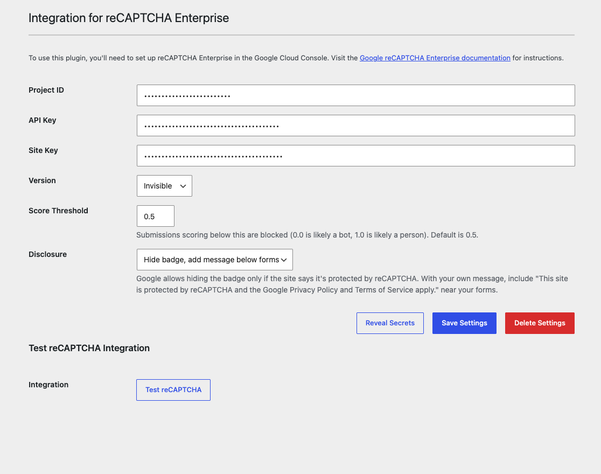

# Integration for reCAPTCHA Enterprise

**Contributors:** Jaemie Gyurik, Clearinghouse for Military Family Readiness at Penn State  
**Tags:** reCAPTCHA, enterprise, security, spam protection, WordPress  
**Requires at least:** 6.0  
**Tested up to:** 7.1.2  
**Requires PHP:** 7.4  
**Stable tag:** 1.2.0
**License:** GPLv2 or later  
**License URI:** https://www.gnu.org/licenses/gpl-2.0.html

Easily integrate Google reCAPTCHA Enterprise with your WordPress site for enhanced security and spam protection.

---

## Description

The **Integration for reCAPTCHA Enterprise** plugin allows you to add Google reCAPTCHA Enterprise to your WordPress site for advanced bot protection. It provides a straightforward way to integrate reCAPTCHA verification into your forms, ensuring a secure user experience.

### Features

- Supports Google reCAPTCHA Enterprise
- Invisible (score-based) and Challenge (checkbox) modes
- Protects Contact Form 7 and User Registration forms with no changes to the forms
- Server-side token verification with an adjustable score threshold
- Badge options: show the Google badge, hide it and add a message below each form, or hide it and add your own message
- Admin settings page for easy configuration
- Built-in test for each mode on the settings page

---

## Installation

1. Download `recaptcha-enterprise-integration.zip` from the [latest release](https://github.com/CMFR/recaptcha-enterprise-integration/releases/latest) (not the "Source code" zip, which installs into a folder named after the version), then upload it under **Plugins** → **Add New Plugin** → **Upload Plugin**.
2. Activate the plugin through the 'Plugins' menu in WordPress.
3. Navigate to **Settings** → **reCAPTCHA** to configure the plugin.

---

## Configuration

To use this plugin, you'll need the following:

- **Project ID**: Your Google Cloud project ID.
- **API Key**: A valid API key for the reCAPTCHA Enterprise API.
- **Site Key**: The site key associated with your project.
- **Version**: **Invisible** for a score-based key, or **Challenge** for a checkbox key. The site key must match the version you pick.
- **Score Threshold** (Invisible only): Submissions scoring below this are blocked. Defaults to 0.5. Lower it if real visitors are being blocked.
- **Disclosure** (Invisible only): Hide the badge and add a message below forms (default), show the Google badge, or hide the badge and add your own message. Google allows hiding the badge only if the site says it's protected by reCAPTCHA.

Refer to the [Google reCAPTCHA Enterprise Documentation](https://cloud.google.com/recaptcha-enterprise/docs) for detailed setup instructions.

---

## Changelog

See [CHANGELOG.md](./CHANGELOG.md) for full release history.

---

## Frequently Asked Questions

### How do I get my Project ID, API Key, and Site Key?

#### **Project ID:**

1. Go to the **Google Cloud Console**: [Google Cloud Console](https://console.cloud.google.com/)
2. Create a new project or select an existing project.
3. The **Project ID** is listed at the top of the project dashboard or in the **Project Settings**.

#### **API Key:**

1. In the **Google Cloud Console**, navigate to **APIs & Services** → **Credentials**.
2. Click **+ CREATE CREDENTIALS** and select **API Key**.
3. Copy the generated API Key.
4. (Recommended) Click **Restrict Key** to secure your API key:
   - Set **Application restrictions** to **None** (for now).
   - Under **API restrictions**, select **reCAPTCHA Enterprise API**.
   - Save the changes.

#### **Site Key:**

1. In the **Google Cloud Console**, navigate to **reCAPTCHA Enterprise**.
2. Click **+ CREATE KEY**.
3. Choose a score-based key for Invisible mode or a checkbox key for Challenge mode.
4. Complete the setup and copy the generated Site Key.

### How do I style the message below forms?

When **Disclosure** is set to **Hide badge, add message below forms**, the plugin adds a `
` right after each protected form. Target `.recaptcha-disclosure` for the text and `.recaptcha-disclosure a` for the links. The plugin only sets a small top margin, font size and line height, so any theme rule on that class overrides it.

### Can I use this plugin with reCAPTCHA v2 or v3?

No, this plugin is specifically designed for Google reCAPTCHA Enterprise.

### Is my API Key secure?

Yes, the API Key is securely stored in the WordPress database, but you should still follow best practices for securing your WordPress installation.

---

## License

This plugin is licensed under the GNU General Public License v2.0 or later.

---

## Support

For support and feedback, please open an issue on the [GitHub repository](https://github.com/CMFR/recaptcha-enterprise-integration).
